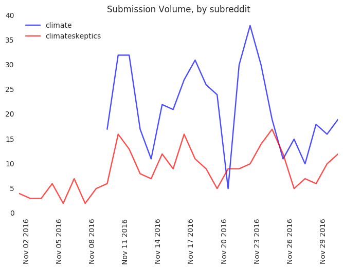
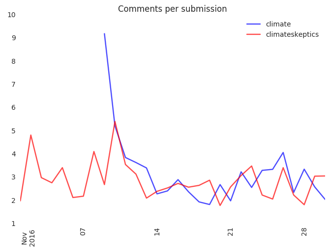
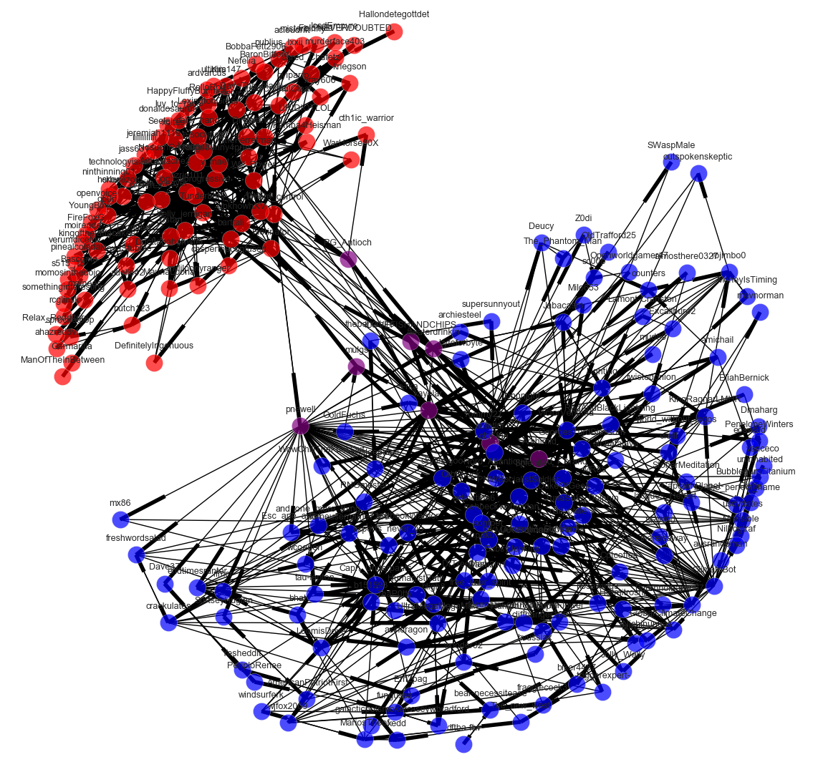
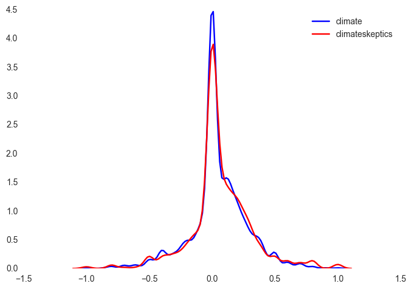

## The Case For Climate on Reddit
_Ben Batorsky_

### Summary
With increasing incidence and severity of extreme weather events, it has never been more important to understand the conversation going on about climate issues.  This is also a time of extreme radicalization on both the left and the right, with divisive rhetoric and a breakdown of cross-aisle negotiation.  In order to understand the mechanisms widening this idealogical chasm and potential ways to bridge it, we need to analyze the conversation occurring on social media.  In this repo is details of the analysis of conversations on Reddit in climate-related subreddits.  I analyze activity, user connectivity and the polarity of language being used in conversations.

The results indicate that climateskeptics redditors generally appear to be more engaged in the conversations in their subreddit and more connected with one another.  The climate subreddit has a more diverse set of redditors that engage less in conversation and more in submitting new content.  Despite these differences, there does not appear to be significant differences in the polarity of conversations taking place.

### Contents
- [Data Sources](#ds)
- [Set up](#Setup)
- [Activity Volumes](#actvol)
- [Active Users](#actuse)
- [Network analysis](#net)
- [Polarity scores](#pol)
- [Limitations](#lim)
- [Future analyses](#fut)

### Data Sources

Data comes from reddit submissions and comments between November 1st, 2016 and December 1st, 2016 for the Reddit subreddits "climate" and "climateskeptics".  It was downloaded using the [PRAW reddit API wrapper](https://praw.readthedocs.io/en/latest/).  User connectivity as analyzed using the [networkx](https://networkx.github.io/) library.  The text of comments were cleaned and analyzed using the [pattern](http://www.clips.ua.ac.be/pattern) library.

### Set up
In order to pull new data, one must obtain the client_id and secret token from registering with the [Reddit API](https://github.com/reddit/reddit/wiki/OAuth2-Quick-Start-Example#first-steps).  Additional first steps and PRAW setup are covered in the [PRAW quick-start guide](https://praw.readthedocs.io/en/latest/getting_started/quick_start.html).

If you do not wish to pull new data, in the data folder are pickled lists of PRAW Submission objects corresponding to each of the subreddits.

Ensure that the following packages are installed:
- matplotlib
- praw
- stopwords
- seaborn
- pandas
- networkx
- pattern

### Activity volumes
First, I looked descriptively at the submission volume for each subreddit:

It appears that generally the climate subreddit has a higher volume of submission.  However, to really understand activity within a subreddit, it made sense to look at the conversation around each of these submissions.  To do that, I looked at comment volume for each subreddit, normalized by the number of submissions:

Though the submission volume for the climate subreddit is higher, the comments per submission are roughly comparable.  This is interesting, as the climate subreddit has more unique users submissing and commenting.  The suggestion is that the smaller number of climateskeptics members are more active than the larger number of climate members.

To examine "activity" generally, I operationaized it as an incidence of a users interacting with the subreddit.  This could be either by submitting a post or by making a comment.  Limitations of this are discussed below.

Conversation spiked in both subreddits in the wake of the election: 147 and 148 submissions to climate on 11/10, 11/11 respectively and 119 submissions to climateskeptics on 11/10.  A quick scan of some of the submissions around this time indicated that most of this activity centered around the climate subreddit discussing how to deal with the Trump victory.  In the climateskeptics subreddit, the focus was also on Trump's victory, but as a repudiation of climate activism.

### Active users
For the climate subreddit, there are 574 unique members (i.e. users engaging in activity).  For the climateskeptics subreddit, there are 236 unique members.  12 users are members of both subreddits.  I extracted the top submitters, commenters and most active (submissions + comments) for each subreddit.  The most active submitter in and most active member of the climate subreddit was /u/pnewell, though his/her activity mainly takes the form of submissions, rather than comments.  For climateskeptics, /u/logicalprogressive is the most active in terms of submissions, comments and total activity.  Another climateskeptics subreddit user, /u/pr-mth-s, appears in the top five submitters, commenters and active users.  However, none of the top five submitters in the climate subreddit are in the top five commenters.  This may mean that climateskeptics members are more engaged in the subreddit's activity, while climate members may be split into commenters and submitters.

### Network analysis
It appears that climateskeptics engage with the subreddit through both comments and posts and do it with enough frequency that they match the per-submission comment amount of the climate subreddit, which has twice as many users.  This suggests that the climateskeptics subreddit has a lot more active, engaged members frequently discussing among themselves.  I wanted to look at this connectivity and see how, if at all, conversation was taking place across subreddits.  To do that, I plotted all instances of users interacting with one another across subreddits.  I used the Fructerman-Reingold force-directed algorithm (spring_layout in networkx) in order to have easy interpretability.

_Figure 3: Network plot of redditor interactions_

The red nodes indicate climateskeptics members, the blue climate members and the purple are members of both.  Networks are directed; lines are thicker in the direction of the interaction (i.e. thicker around the person being responded to).  Spring_layout attempts to minimize the number of overlapping lines/nodes for more interpretable layout.  The result is nodes that are more closely interconnected are plotted close to one another and those with fewer connections are plotted farther away from the core.

The two subreddits have little connectivity to one another, which is predictable, based on the low number of users who are members of both.  However, those cross-aisle members appear to be more closely connected with the climate members than the climateskeptics members.  The climateskeptics members appear to be a very close-knit community, with a dense network of links to one another.  That is not so much the case with the climate members, who appear to have an inner circle of close-knit members, but a large number of members on the periphery. 

### Polarity scores
In order to understand the quality of the conversation taking place in the two subreddits, I examined the polarity of the words being used in comments.  The polarity score is calculated using a dictionary of terms with each word scored as negtive or positive on a range of -1 to 1.  Each term is scored individually and the score of all the words together is summed to get the comment's polarity score.  Generally, this summed to zero, as one can see from the distribution plot below.

_Figure 4: Polarity of comments by subreddit _

The differences in polarity, overall, were not significant.  I also examined the polarity of comments that were voted at zero or below (i.e. those that users disliked) versus those that were voted above zero.  The distributions of positive-voted comments were roughly the same as the overall distribution, due to most of the comments in the data being positively-voted.  The distributions of negative-or-zero voted were different for the subreddits, but this is likely an artifact of the small number of zero and negative posts.  In order to clearly understand differences in the comments between subreddits, additional analysis would have to be done.

### Limitations
One major limitation is that the data from the API only includes a 1,000 submission cache.  For the climateskeptics subreddit, this wasn't a problem, as they have lower volume of submissions.  For the climate subreddit, however, one can see from the volume graph that posts only go back to 11/9.  More specifically, 11/9 at 7am UTC (which was used for the conversion to date).  That definitely skews the results throughout.  Future research could use different time frames or the (reddit BigQuery database)[https://bigquery.cloud.google.com/dataset/fh-bigquery:reddit_comments].

Activity as the sum of submissions and comments may be simplistic, as submissions require more effort and are qualitatively different from comments.  Also, there's other measures like activity patterns (e.g. a user who posted around the election, then stopped) and users who have a conversation with other members versus post and forget.  There's a lot of future analysis that could be be done on this aspect alone.

Another limitation is that I focused on daily activity, rather than using the actual UTC timestamp.  More granular analysis would reveal times of high activity and could lead to insights on weekly trends.

### Future research
In order to understand the conversation generally, a similar time-frame should be selected for each subreddit.  To understand how the different communities interpret current events (e.g. election results), it would be important to select a time frame around that event and compare volumes and conversation qualities, normalized for usual volumes and qualities.  Using these scripts, it would be simple to pull a new set of data and perform similar analyses as those outlined here.

From the network diagram, we can see that climateskeptics members tend to be close-knit versus the climate members, which have a much more spread out network.  There is also very little conversation going on between the two communities.  It would be important to analyze the small number of cross-aisle members to see how they contribute to each subreddits conversation and on what topics there is overlap.  It would also be interesting to analyze groups within the climate subreddit.  It appears there is a core of connectivity and potentially a few clusters outside the "inner circle" of members.  Splitting the conversation up into these micro-communities may lead to better understanding of the conversation as a whole.

In this research I only grazed the surface of the conversation dynamics being used in the conversations in these subreddits.  Additional analysis to understand which submissions/comments stimulate activity (e.g. numerous votes or comments) would allow us to better understand patterns in conversation and what resonates with members, either positively or negatively.  

Further, applying NLP techniques to the full text of comments and self-posts may yield additional insights.  By training a Word2Vec model on the two separate subreddits, we may be able to construct a sort of conceptual diagram for each of the subreddits.  For example, Trump likely means very different things to each subreddit, but what about the UN? What about an incident like flooding in Lousiana? A focused analysis of patterns in discussion would likely reveal interesting aspects of the conversation.
